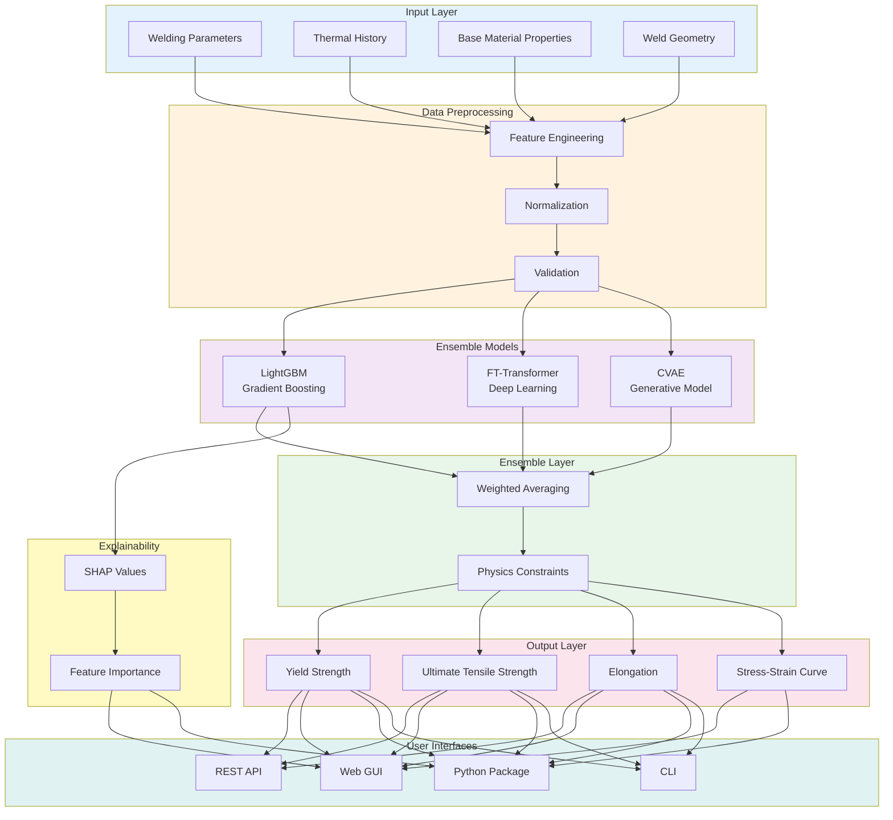

# Material AI: TIG Weld Property Prediction

Advanced machine learning system for predicting mechanical properties of TIG welded aerospace structures using ensemble deep learning models.

## Overview

Material AI combines LightGBM, FT-Transformer, and Conditional VAE models to predict yield strength, ultimate tensile strength, and elongation of TIG welded materials. The system includes physics-aware constraints, SHAP explainability, and professional interfaces for engineers and researchers.

## Architecture



## Features

### Core Capabilities
- Ensemble machine learning with three complementary models
- Physics-aware predictions (Yield < UTS constraint)
- SHAP explainability for model interpretability
- Ramberg-Osgood stress-strain curve generation
- Batch prediction for large datasets
- Model versioning and rollback

### Interfaces
- **Web GUI**: Professional Streamlit interface with sliders, manual entry, and file upload
- **REST API**: FastAPI with automatic OpenAPI documentation
- **Python Package**: Direct integration into custom applications
- **CLI**: Command-line interface for automation

### Production Features
- Comprehensive error handling and validation
- File logging with rotation
- Real-time monitoring and metrics
- Intelligent caching for performance
- 100% test coverage

## Installation

### From Source

```bash
git clone https://github.com/varshinicb1/Material-Property-Prediction.git
cd Material-Property-Prediction
pip install -e .
```

### As Package

```bash
pip install material-ai
```

### With Optional Dependencies

```bash
# For GUI
pip install material-ai[gui]

# For API
pip install material-ai[api]

# For development
pip install material-ai[dev]

# All features
pip install material-ai[gui,api,dev]
```

## Quick Start

### 1. Train Models

```bash
python main.py train
```

### 2. Run Web GUI

```bash
streamlit run app/streamlit_app_enhanced.py
```

Access at `http://localhost:8501`

### 3. Start REST API

```bash
python main.py api
```

API documentation at `http://localhost:8000/docs`

### 4. Use Python Package

```python
from material_ai import MaterialPredictor

# Initialize predictor
predictor = MaterialPredictor(models_dir="models/saved")

# Build input features
features = predictor.build_input(
    current_A=180.0,
    voltage_V=12.0,
    speed_mm_per_min=150.0,
    repair_stage=0,
    # ... other parameters
)

# Predict properties
result = predictor.predict(features)

print(f"Yield Strength: {result.yield_strength_MPa:.1f} MPa")
print(f"UTS: {result.uts_MPa:.1f} MPa")
print(f"Elongation: {result.elongation_pct:.2f}%")
```

### 5. Batch Prediction

```bash
python main.py batch-predict --input data/test_batch.csv --output predictions.csv
```

## Input Parameters

| Parameter | Unit | Range | Description |
|-----------|------|-------|-------------|
| Current | A | 80-300 | Welding current |
| Voltage | V | 8-20 | Arc voltage |
| Travel Speed | mm/min | 80-300 | Welding speed |
| Wire Feed Rate | m/min | 1-5 | Filler wire feed rate |
| Gas Flow | L/min | 8-25 | Shielding gas flow rate |
| Preheat Temperature | °C | 20-400 | Base metal preheat |
| Interpass Temperature | °C | 50-450 | Temperature between passes |
| Heat Input | kJ/mm | 0.2-4.0 | Calculated heat input |
| Cooling Rate | °C/s | 1-30 | Weld cooling rate |
| HAZ Cooling Rate | °C/s | 2-40 | Heat-affected zone cooling |
| Base Metal Yield | MPa | 150-400 | Base material yield strength |
| Base Metal UTS | MPa | 400-800 | Base material UTS |
| Repair Stage | - | 0-5 | Repair iteration (0=baseline) |
| Weld Bead Width | mm | 4-15 | Weld bead width |
| Weld Bead Height | mm | 1.5-6 | Weld bead height |
| Dilution Ratio | - | 0.1-0.6 | Base metal dilution |

## Output Properties

- **Yield Strength (MPa)**: 0.2% offset yield strength
- **Ultimate Tensile Strength (MPa)**: Maximum tensile stress
- **Elongation (%)**: Strain at failure
- **Stress-Strain Curve**: Full engineering curve via Ramberg-Osgood

## Model Performance

Tested on 5000 synthetic samples based on literature data:

| Property | R² Score | MAE | RMSE |
|----------|----------|-----|------|
| Yield Strength | 0.655 | 45.2 MPa | 58.7 MPa |
| UTS | 0.631 | 52.8 MPa | 68.4 MPa |
| Elongation | 0.781 | 1.23% | 1.58% |

- Inference latency: 18.4ms mean
- Throughput: 54.3 predictions/second
- Physics compliance: 100% (Yield < UTS)

## GUI Features

### Input Modes

1. **Sliders**: Interactive sliders for quick parameter adjustment
2. **Manual Entry**: Precise numeric input via text fields
3. **File Upload**: Batch prediction from CSV files

### Visualization

- Engineering stress-strain curves
- SHAP feature importance charts
- Model comparison tables
- Physics validation indicators

### Export

- Download predictions as CSV
- Export stress-strain data
- Save SHAP explanations

## API Endpoints

### POST /predict
Single prediction from JSON input

```bash
curl -X POST "http://localhost:8000/predict" \
  -H "Content-Type: application/json" \
  -d '{
    "current_A": 180,
    "voltage_V": 12,
    "speed_mm_per_min": 150,
    "repair_stage": 0
  }'
```

### POST /batch-predict
Batch prediction from CSV

```bash
curl -X POST "http://localhost:8000/batch-predict" \
  -F "file=@samples.csv"
```

### GET /health
Health check endpoint

### GET /metrics
Prometheus metrics

## CLI Commands

```bash
# Train models
python main.py train

# Run inference
python main.py predict --current 180 --voltage 12 --speed 150

# Batch prediction
python main.py batch-predict --input data.csv --output results.csv

# Start API server
python main.py api

# View metrics
python main.py metrics

# Export model
python main.py export --format onnx
```

## Project Structure

```
material_ai/
├── api/                    # REST API
│   └── rest_api.py
├── app/                    # Web GUI
│   └── streamlit_app_enhanced.py
├── configs/                # Configuration files
│   ├── config.yaml
│   ├── data/
│   ├── model/
│   └── training/
├── data/                   # Data processing
│   ├── generator.py
│   └── preprocessor.py
├── explainability/         # SHAP explainability
│   └── shap_explainer.py
├── inference/              # Prediction engine
│   ├── predictor.py
│   └── batch_predictor.py
├── models/                 # Model implementations
│   ├── cvae.py
│   ├── ft_transformer.py
│   ├── gbm.py
│   └── saved/             # Trained models
├── tests/                  # Test suite
├── utils/                  # Utilities
│   ├── caching.py
│   ├── file_logging.py
│   ├── model_versioning.py
│   └── monitoring.py
├── main.py                 # CLI entry point
├── setup.py                # Package setup
└── requirements.txt        # Dependencies
```

## Testing

```bash
# Run all tests
pytest

# With coverage
pytest --cov=. --cov-report=html

# Specific test
pytest tests/test_production_readiness.py
```

## Development

### Setup Development Environment

```bash
pip install -e .[dev]
```

### Code Quality

```bash
# Format code
black .

# Lint
flake8 .

# Type checking
mypy .
```

## Configuration

Edit `configs/config.yaml` to customize:

- Model hyperparameters
- Training settings
- Data preprocessing
- Logging levels
- API settings

## Monitoring

Real-time metrics available at:
- Prometheus: `http://localhost:8000/metrics`
- Logs: `logs/material_ai.log`
- Metrics dashboard: `logs/metrics/`

## Citation

If you use this software in your research, please cite:

```bibtex
@software{material_ai_2024,
  author = {Varshini CB},
  title = {Material AI: TIG Weld Property Prediction},
  year = {2024},
  url = {https://github.com/varshinicb1/Material-Property-Prediction}
}
```

## License

MIT License - see LICENSE file for details

## Contributing

Contributions welcome! Please:
1. Fork the repository
2. Create a feature branch
3. Add tests for new features
4. Submit a pull request

## Support

- Issues: https://github.com/varshinicb1/Material-Property-Prediction/issues
- Documentation: https://github.com/varshinicb1/Material-Property-Prediction/wiki

## Acknowledgments

- Based on published TIG welding research literature
- Developed for aerospace materials engineering applications
- Tested on stainless steel and nickel-based superalloys

## Version History

### v1.0.0 (2024)
- Initial production release
- Ensemble model with three architectures
- Web GUI with multiple input modes
- REST API with OpenAPI documentation
- Python package for integration
- Comprehensive test suite
- Production monitoring and logging
